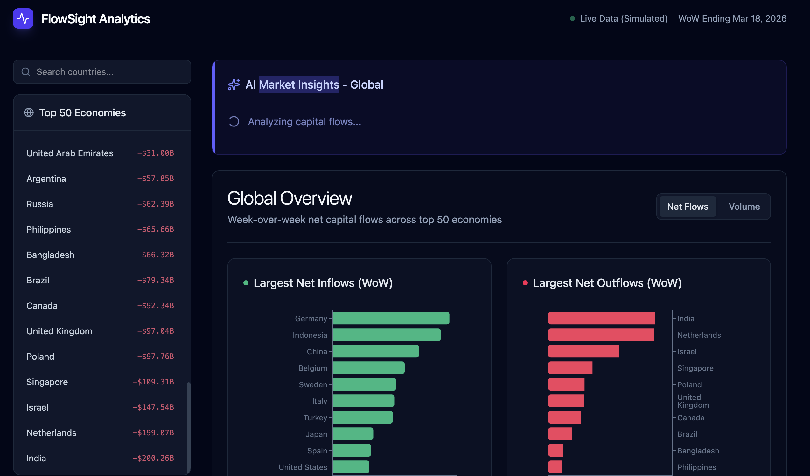

# Global Capital Flows Analytics

A comprehensive web application to analyze week-over-week global money movement across the top 50 economies and major asset classes.



## Features

- **Global Capital Flows Dashboard**: A sleek, dark-themed financial dashboard that provides an overview of week-over-week (WoW) net capital flows.
- **Simulated Dataset**: Robust, seeded mock data generator creating realistic flow data (in Billions USD) for 50 countries across 6 major asset classes.
- **Global Analytics**: Interactive bar charts highlighting the top 10 countries with the largest net inflows and outflows.
- **Country-Specific Deep Dive**: Detailed breakdown of net flows into specific asset classes (Equities, Fixed Income, Real Estate, Commodities, Crypto, and Cash/FX).
- **AI Market Insights**: Integrated Gemini AI virtual financial analyst that generates concise, professional macroeconomic summaries explaining potential drivers for capital movements.

## Tech Stack

- **Frontend**: React 19, TypeScript, Vite
- **Styling**: Tailwind CSS
- **Charts**: Recharts
- **Icons**: Lucide React
- **AI Integration**: Google GenAI SDK (Gemini)

## Getting Started

1. Install dependencies:
   ```bash
   npm install
   ```

2. Set up your environment variables by copying `.env.example` to `.env` and adding your Gemini API key:
   ```bash
   GEMINI_API_KEY="your_api_key_here"
   ```

3. Start the development server:
   ```bash
   npm run dev
   ```

## Adding the Screenshot

To display the homepage screenshot in this README:
1. Take a screenshot of the running application.
2. Save the image file as `screenshot.png` in the root directory of this project.
3. The image will automatically appear at the top of this README file.
